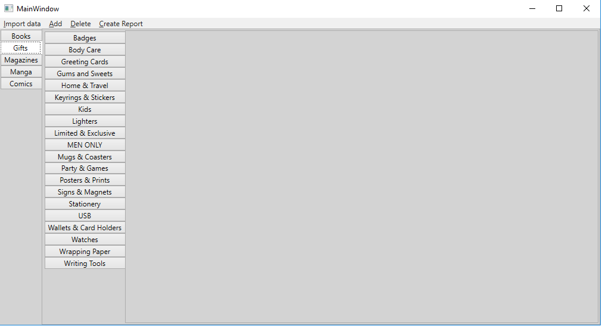
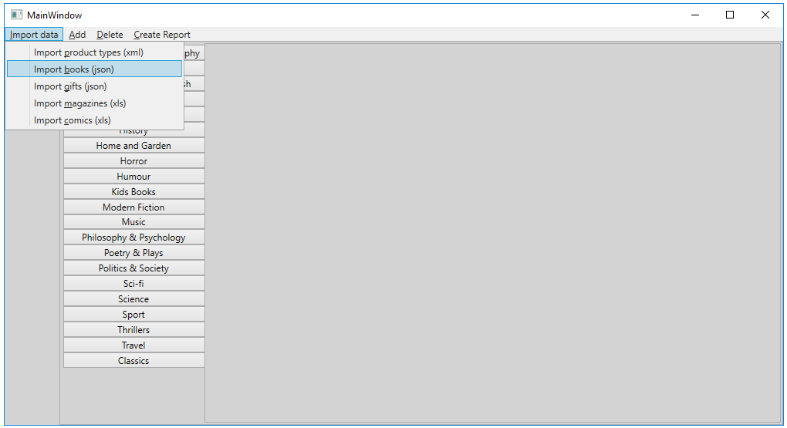
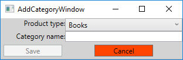
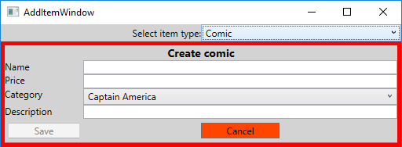
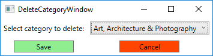
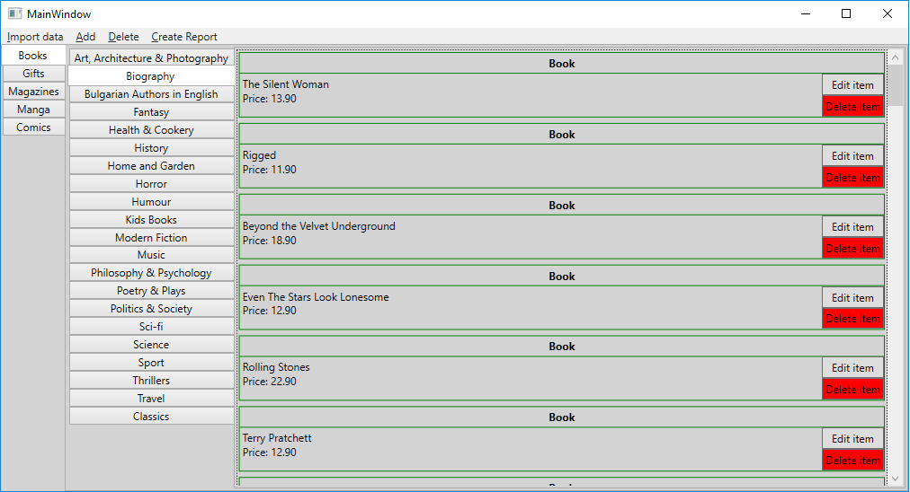
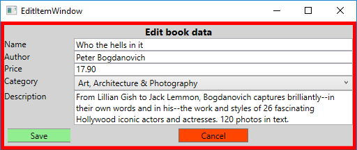
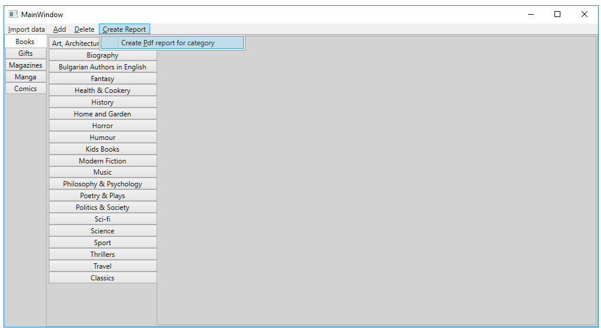

# Entities-6-Databases-Teamwork
A very basic desktop client for employees in the Elephant book store to be able to edit the products offered by the company. 

Every user can import data from the corresponding file types.

The database schema looks like this: 

The main window shows all product types with their corresponding categories.

The menu gives the ability to import data:

Also categories and items can be added without being written into file:

 

You can delete a category, which will cascade delete all items that belong to that category:

You can edit item data or delete the item itself (which will not delete it from the database) using the UI:

Also you can create report for a category of your choice:

Which will result in a table with the items in the category presented in pdf format:
